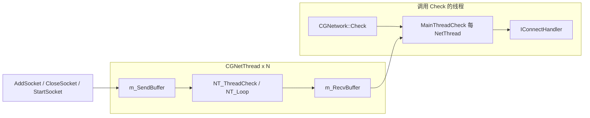

# GammaNetwork 模块文档

## 概述

GammaNetwork 是 **nany-cpp** 中的**网络 I/O 与套接字抽象层**：封装 Windows（Winsock）与 Linux（epoll / select）上的 TCP/UDP 监听与连接、**异步域名解析**、**OpenSSL（TLS）** 客户端/服务端上下文，以及多 **网络线程** 上的 **Reactor** 式事件分发。上层模块（如 **GammaConnects**）在 `IConnecter` / `IConnectHandler` 之上实现协议与会话逻辑。

## 模块定位与依赖

| 项目 | 说明 |
|------|------|
| 依赖 | **GammaCommon**（线程、容器、锁、对象池等） |
| 第三方 | **OpenSSL**（SSL/TLS）、平台 **Winsock** / **BSD socket** |
| 构建 | Windows 下为**静态库**；Linux 下为**动态库**（`GAMMA_DLL`），并链接 `GammaCommon` 与 common.cmake 中的 CURL/OpenSSL 等 |
| 导出宏 | `GAMMA_NETWORK_API` |
| 命名空间 | `Gamma` |

头文件路径（相对工程 `include`）：`GammaNetwork/*.h`。

> **说明**：`CAddress.h` 中 `#include "GammaConnects/ConnectDef.h"`，在仅依赖 GammaNetwork 的工程中需保证 **include 路径** 能解析到 GammaConnects 头文件（或视为与上层模块的耦合点）。

## 架构概览

```
应用 / GammaConnects（实现 IConnectHandler，处理 OnRecv 等）
        │
        ▼
INetwork::CreateNetWork() → CGNetwork
        │  Check(nTimeOut)：主线程驱动（解析完成队列、延迟断开、各 NetThread::MainThreadCheck）
        ├── 域名：CAddrResolutionDelegate / CAddrResolution（异步解析，结果推入连接队列）
        ├── 监听：StartListener → CGListener + CGSocketTCP/UDP/TCPS
        └── 连接：Connect → CGConnecterTCP/UDP + 解析委托排队
        │
        ▼
CGNetThread（每线程一个）：内部线程循环 NT_Loop，管理套接字集合
        │  Linux：epoll（非 FORCE_SELECT_MODE）
        │  Windows / 强制模式：select 等
        ▼
CGSocket*（CGSocketTCP、CGSocketUDP、CGSocketTCPS 等）：读写、事件上报
```

- **多线程模型**：`CGNetwork` 构造时可指定 `nNetworkThread`（默认 `INVALID_32BITID` 时按实现取 **2** 个网络线程）。新连接按 **`GetMinSocketThread()`** 负载均衡挂到负载最轻的线程。
- **主线程与网络线程通信**：通过 `CCircleBuffer` 等命令队列（`ENetCmd`：`AddSocket`、`RemoveSocket`、`DataArrived`、`Accept`、`Connected` 等）在 **主线程** 与 **网络线程** 之间投递工作；`Check()` 主要在**调用线程**上处理解析回调、断开列表及各线程的 `MainThreadCheck()`。

## 线程模型与数据流

本节从实现角度说明 `CGNetwork`、`CGNetThread`、`CGSocket` 的协作方式；细节以 `source/gamma/GammaNetwork` 源码为准。

### 线程角色

| 角色 | 说明 |
|------|------|
| **调用 `Check()` 的线程** | 文档中常称「主线程」，实为**任意周期性调用 `INetwork::Check` 的线程**。负责：异步解析完成后的继续建连、延迟断开列表、以及对每个 `CGNetThread` 调用 `MainThreadCheck()` 以消费网络线程投递的事件。 |
| **若干 `CGNetThread`（默认 2 个）** | `CGNetwork` 构造时用 `GammaCreateThread` 启动；线程过程为 `NT_RunThread` → 循环 `NT_ThreadCheck()`。内部顺序为：从 **`m_SendBuffer`** 取命令并执行 `NT_OnAdd` / `NT_OnRemove` / `NT_OnStart`，再进入 **`NT_Loop()`** 做 Reactor（发送冲刷、Linux `epoll_wait` / Windows `WSAEventSelect`+`WaitForMultipleObjects` / `FORCE_SELECT_MODE` 下 `select`，多路复用超时一般为 **0**）。 |

**负载均衡**：新建 socket 时通过 `CGNetwork::GetMinSocketThread()` 选择当前 **`GetSocketCount()` 最小** 的网络线程作为 `CGSocket::m_pWorkThread`。

### 双队列命名（相对网络线程）

每个 `CGNetThread` 维护两个 `CCircleBuffer`：

| 队列 | 方向 | 生产者 | 消费者 |
|------|------|--------|--------|
| **`m_SendBuffer`** | **进入**网络线程的工作队列 | 调用 `AddSocket` / `CloseSocket` / `StartSocket` 的路径（多为应用/`Check` 侧逻辑） | `NT_ThreadCheck()` 中 `PopBuffer` |
| **`m_RecvBuffer`** | **离开**网络线程、交给 `Check` 侧的事件队列 | `NT_OnAccept`、`NT_OnConnected`、`NT_RecieveData`、`NT_OnRemove` 等 | `MainThreadCheck()` |

`ENetCmd` 与方向对应关系简述：

- 经 **`m_SendBuffer`**：`eNC_AddSocket`、`eNC_RemoveSocket`、`eNC_Start`。
- 经 **`m_RecvBuffer`**：`eNC_Accept`（可带 listener 指针）、`eNC_Connected`、`eNC_DataArrived`（附数据）、以及移除完成时的 `eNC_RemoveSocket`（与 `OnRemoved` 释放对象配合）。

### `Check()` 内处理顺序

`CGNetwork::Check` 大致顺序为：

1. 处理 **`m_listFinished`**：异步域名解析完成后，对挂起的 `CGConnecter` 继续 `Connect`。
2. 处理 **`m_listDisConnSocket`**：对排队节点执行 `Close(eCE_ShutdownOnCheck)`。
3. 对每个网络线程调用 **`MainThreadCheck()`**：排空 **`m_RecvBuffer`**，依次触发 `OnAccept`、`OnRemoved`、`OnConnected`、`OnDataRecieve` → 最终到 `CGConnecter::OnEvent` 与 **`IConnectHandler`**。

因此：**若不持续调用 `Check()`，解析收尾、统一断开以及所有「网线程 → 应用」的回调都会停滞。**

### 数据路径

**收包（内核 → 应用回调）**

1. 网络线程在 `NT_ProcessEvent` / 读路径中从 socket 读取数据，调用 `NT_RecieveData`，将 **`eNC_DataArrived`** 与缓冲区内容写入 **`m_RecvBuffer`**。
2. 应用线程在 `Check` → `MainThreadCheck` 中弹出并调用 `OnDataRecieve` → `CGConnecter::OnEvent` → **`IConnectHandler::OnRecv`**。

结论：**`OnRecv` 等面向业务的回调在调用 `Check()` 的线程上执行**，网络线程仅负责 I/O 与入队。

**发包（应用 → 内核）**

- `Send` 将数据挂入 socket 侧发送链；`NT_Loop` 中在可写条件下通过 `NT_ProcessEvent(eNE_ConnectedWrite, …)` 等路径写出。

### TCP Accept 与 UDP 监听的线程差异

- **TCP**：`accept` 得到独立 fd，可在主线程路径 `OnAccept` 中创建 `IConnecter` 后再 **`AddSocket` / `StartSocket`** 到**选定**的网络线程，并在该线程上注册 epoll/事件（见 `NT_OnAdd` 中对已具备 local/remote 地址的 TCP 套接字的注释）。
- **服务端 UDP**：监听 socket 与业务共用，**无法**像 TCP 那样把不同逻辑连接拆到不同网络线程；相关逻辑留在 **listener 所在网络线程**，`NT_OnAccept` 中对非 TCP 会将 socket 直接加入本线程 `m_listSockets`（源码注释有说明）。

### 关系示意



## 工厂与核心接口

### `CreateNetWork`

```cpp
GAMMA_NETWORK_API INetwork* CreateNetWork(
    uint32_t nMaxConnect = -1,
    uint32_t nNetworkThread = -1);
```

- `nMaxConnect`：传入各 `CGNetThread` 的容量相关参数（具体语义见 `CGNetThread` 实现）。
- `nNetworkThread == INVALID_32BITID` 时，实现里会按 **2** 个网络线程创建（见 `CGNetwork` 构造函数）。

### `INetwork`（`INetworkInterface.h`）

| 方法 | 作用 |
|------|------|
| `Release()` | 释放网络实例（实现为 `delete this`） |
| `EnableLog(bool)` | 是否输出网络层日志 |
| `PreResolveDomain(const char* szAddress, uint32_t nValidSeconds = INVALID_32BITID)` | **预解析**域名或地址，结果缓存有效时间由 `nValidSeconds` 控制；可与上层 `INetworkInterface::PreResolveDomain`（GammaConnects 转发）配合减少首连延迟 |
| `StartListener(...)` | 在 `szAddres`/`nPort` 上监听；`EConnecterType` 为 `eConnecterType_TCPS` 时需传入 **PEM 证书与私钥路径** |
| `Connect(...)` | 主动连接；TLS 使用客户端 `SSL_CTX` |
| `Check(uint32_t nTimeOut)` | **必须周期性调用**；处理解析完成后的连接建立、待断开套接字、各网络线程向主线程的回调 |

### `EConnecterType`

| 值 | 含义 |
|----|------|
| `eConnecterType_UDP` | UDP |
| `eConnecterType_TCP` | 明文 TCP |
| `eConnecterType_TCPS` | TCP + TLS（OpenSSL）；监听需证书，连接用全局客户端 `SSL_CTX`） |

### `IListener`

设置 `IListenHandler`，查询本地地址、类型，`Release()`。

### `IConnecter`

对单次连接抽象：

- **控制**：`CmdClose`、`Send`、`CheckRecvBuff`
- **回调对象**：`SetHandler` / `GetHandler` → **`IConnectHandler`**
- **地址**：`GetLocalAddress` / `GetRemoteAddress`（`CAddress`）
- **状态**：`IsConnecting` / `IsConnected` / `IsDisconnected` / `IsDisconnecting` / `IsEverConnected`
- **统计与诊断**：收发总字节、`GetCloseType`（`ECloseType`）、各时间戳（创建、连接、首次事件、连接成功等）

### `IConnectHandler`（`INetHandler.h`）

| 回调 | 含义 |
|------|------|
| `OnConnected()` | 连接成功（含 TLS 握手完成等，依实现） |
| `OnDisConnect(ECloseType)` | 断开；`ECloseType` 区分超时、对端关闭、本端优雅/强制关闭等 |
| `OnRecv(const char* pBuf, size_t nSize)` | 收到数据；返回值表示已消费字节数（流式解析） |

### `IListenHandler`

- `OnAccept(IConnecter& Connect)`：新连接到达，由上层接管并 `SetHandler`。

## 地址 `CAddress`

- 保存字符串形式 IP、二进制 IP（`uint32_t`）、端口；支持 `GetPackAddress` 等打包比较。
- 全局工具：`ConVertAddressToInt32`、`ConvertInt32ToAddress`、`IsIP`、`IsPort`；Windows 下另有 `GetLocalHostIP()`。

## 关闭原因 `ECloseType`

涵盖缓冲区失败、地址复用、拒绝、超时、不可达、非法地址、Reset，以及本框架使用的 `ShutdownImmediatly`、`ShutdownOnCheck`、`NormalClose`、`GraceClose`、`ForceClose` 等，便于日志与重连策略。

## TLS / OpenSSL

- `CGNetwork` 构造时：`SSL_library_init`、`SSL_load_error_strings`、算法注册；服务端方法 `SSLv23_server_method`，客户端 `SSLv23_client_method`，并创建 **客户端** `SSL_CTX`。
- **服务端 TLS**：`StartListener` 在 `eConnecterType_TCPS` 时按「证书路径:私钥路径」字符串为 key 缓存 **`SSL_CTX`**（`m_mapServerContexts`），同一对文件复用同一上下文。
- **客户端 TLS**：`Connect` 在 TCPS 时使用 `m_sslClientContext`。

析构时释放各 `SSL_CTX`。

## 实现侧要点（源码索引）

| 组件 | 文件（节选） | 说明 |
|------|----------------|------|
| 网络总控 | `CGNetwork.*` | `Check`、监听/连接创建、解析与断开队列、发送缓冲池 `Alloc`/`Free` |
| 网络线程 | `CGNetThread.*` | epoll/select、套接字生命周期、与主线程的命令缓冲 |
| 连接器 | `CGConnecter.*`、`CGConnecterTCP`/`UDP` | 实现 `IConnecter`，状态机，与 `CGSocket` 协同 |
| 监听 | `CGListener.*` | `IListener` 实现 |
| 套接字 | `CGSocket.*` | TCP/UDP/TCPS 等 |
| 缓冲 | `CGNetBuffer.*` | 收发与发送链表等 |
| 域名解析 | `CAddrResolution.*` | 异步解析、`CAddrResolutionDelegate` 树/链表与完成通知 |

## 与 GammaConnects 的关系

- **GammaNetwork** 只负责「**字节流/数据报 + 连接生命周期**」。
- **GammaConnects** 使用 `CreateNetWork()`（经 `CConnectionMgr`），将 `CGConnecter` 包装为 `CConnection`，再叠加 Shell 协议、KCP、WebSocket 等。

典型调用链：**业务循环** → `IConnectionMgr::Check` → `INetwork::Check`。

## 使用注意

1. **`Check()` 必须被持续调用**，否则解析完成、断开处理、线程向主线程投递的回调无法推进。
2. **主动连接**：`Connect` 会把连接器挂到 **域名解析委托** 上，解析成功后再真正 `Connect`；主机名请走 `PreResolveDomain` 或确保解析路径可用。
3. **线程安全**：套接字读写主要在**网络线程**；向应用层 `OnRecv` 等回调的线程模型以 `CGNetThread` / `MainThreadCheck` 实现为准，上层若跨线程访问连接状态需自行同步。
4. **资源释放**：`INetwork::Release()` 前建议先关闭监听与连接，析构中会 `Check(0)` 并销毁网络线程与 SSL 上下文。

---

*文档依据 `source/gamma/GammaNetwork` 与 `include/gamma/GammaNetwork` 当前实现整理；细节以源码为准。*
