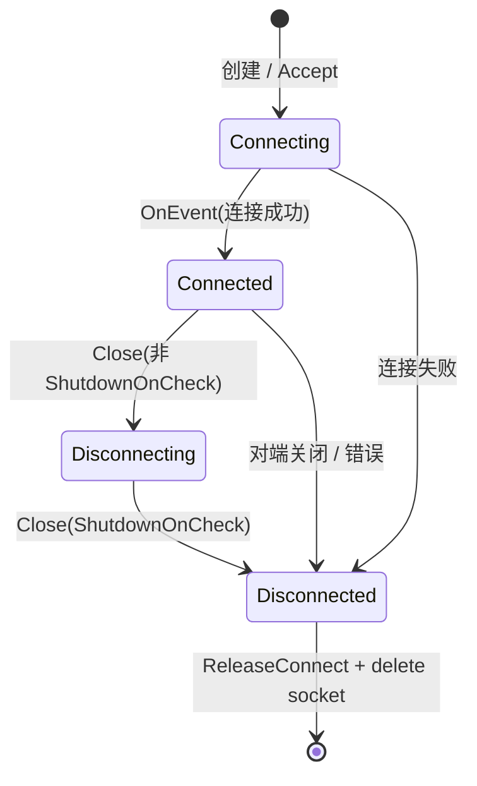
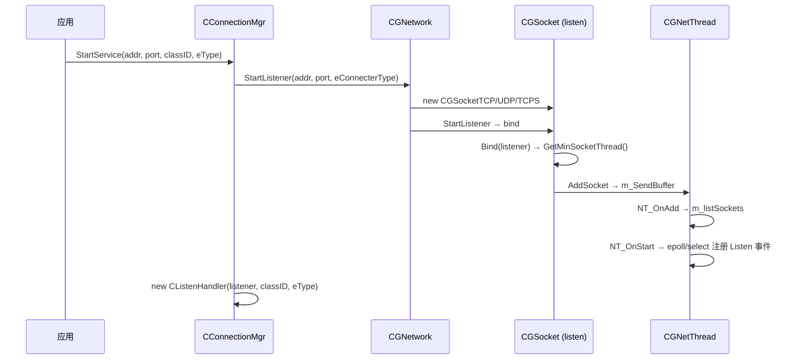
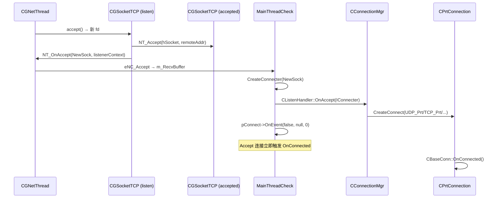
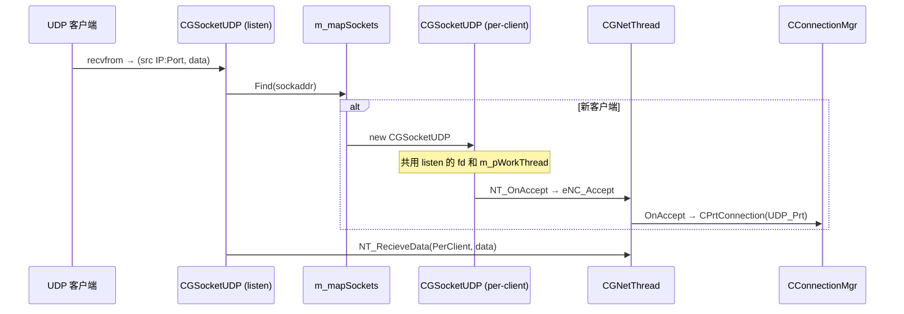
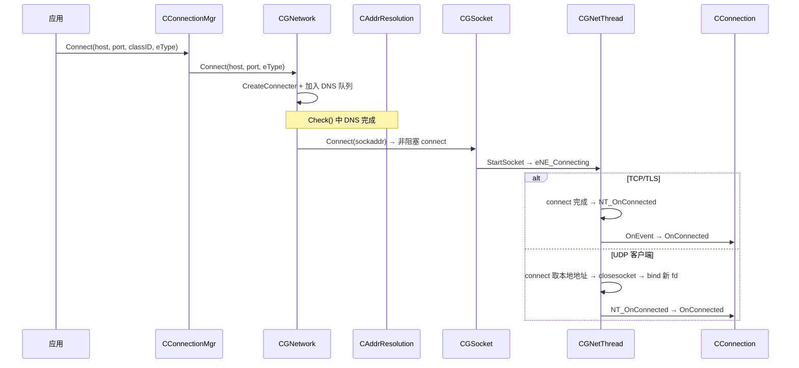
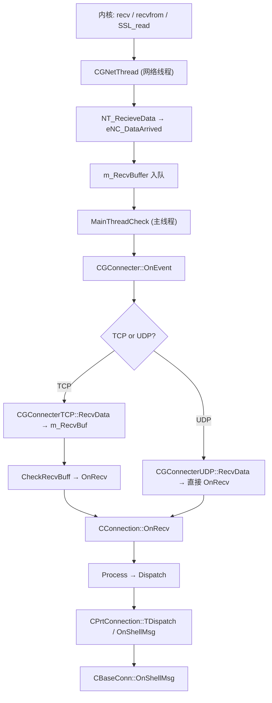
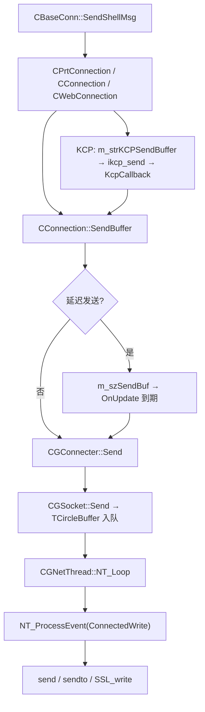

# Socket 全流程分析

本文档描述 nany-cpp 网络栈中 **连接建立、数据接收、数据发送、连接关闭** 的完整流程，覆盖 **GammaNetwork（I/O 层）** 与 **GammaConnects（会话层）**。

> 相关文档：[网络架构分析.md](./网络架构分析.md) · [GammaNetwork.md](./GammaNetwork.md) · [GammaConnects.md](./GammaConnects.md)

---

## 1. 总览

### 1.1 驱动模型

所有网络事件依赖 **`Check()` 循环** 驱动：

```
应用主循环
  └── IConnectionMgr::Check(nWaitTimes)          // GammaConnects
        ├── CConnection::OnUpdate()            // KCP / 延迟收发
        └── INetwork::Check()                  // GammaNetwork
              ├── DNS 解析完成 → 继续 Connect
              ├── m_listDisConnSocket → 真正 Close
              └── CGNetThread::MainThreadCheck() × N
                    └── OnAccept / OnConnected / OnDataRecieve
```

**结论：** `OnConnected`、`OnRecv`、`OnDisConnect`、`OnShellMsg` 均在 **调用 `Check()` 的线程**（下称「主线程」）执行；网络线程只做 I/O 与事件入队。

### 1.2 连接状态机

**CGConnecter 层（`EConnectState`）：**



**CConnection 层（应用可见）：**

| 状态 | 判断条件 |
|------|---------|
| Connecting | `IConnecter::IsConnecting()` |
| Connected | `IConnecter::IsConnected()` |
| Disconnecting | `IConnecter::IsDisconnecting()` |
| Disconnected | `!IConnecter \|\| IsDisconnected()` |

### 1.3 跨线程命令队列

每个 `CGNetThread` 维护两个 `CCircleBuffer`：

| 队列 | 方向 | 命令 |
|------|------|------|
| `m_SendBuffer` | 主线程 → 网络线程 | `eNC_AddSocket`、`eNC_RemoveSocket`、`eNC_Start` |
| `m_RecvBuffer` | 网络线程 → 主线程 | `eNC_Accept`、`eNC_Connected`、`eNC_DataArrived`、`eNC_RemoveSocket` |

---

## 2. 连接建立

### 2.1 服务端监听（StartService）



**关键代码：**

```215:236:source/gamma/GammaNetwork/CGSocket.cpp
	void CGSocket::StartListener( const char* szAddres, uint16_t nPort )
	{
		m_bListener = true;
		Create( AF_INET );
		// bind ...
		m_pWorkThread->StartSocket( this );
	}
```

```151:163:source/gamma/GammaNetwork/CGSocket.cpp
	void CGSocket::Bind( void* pContext )
	{
		if( m_pWorkThread != nullptr )
			return;  // UDP 服务端子连接复用 listener 线程
		m_pWorkThread = m_pNetwork->GetMinSocketThread();
		m_pWorkThread->AddSocket( this );
	}
```

### 2.2 TCP 服务端 Accept



**TCP Accept 特点：**

- `accept` 得到 **独立 fd**，可在 `Bind()` 时分配到 **负载最轻的网络线程**（与 listener 不一定同线程）。
- Accept 产生的 socket 已有 local/remote 地址，`CGConnecter` 构造时设为 `eCS_Connecting`，随后 `OnEvent(false,null,0)` **立即转为 Connected** 并回调 `OnConnected`。

```550:558:source/gamma/GammaNetwork/CGSocket.cpp
	CGSocketTCP* CGSocketTCP::NT_Accept( SOCKET hSocket, const sockaddr_in& addrRemote )
	{
		CGSocketTCP* pNewSocket = new CGSocketTCP( m_pNetwork );
		pNewSocket->m_strRemoteSockAddr.assign(...);
		pNewSocket->m_strLocalSockAddr.assign(...);  // 继承 listener 本地地址
		pNewSocket->m_hSocket = hSocket;
		return pNewSocket;
	}
```

### 2.3 UDP 服务端首包建连



**UDP 服务端特点：**

- **所有客户端共用 listen socket fd**，按 `(remote IP, Port)` 区分逻辑连接。
- 子连接 **不能** 拆到其他网络线程，固定留在 listener 所在线程。
- `NT_OnAccept` 中 UDP 会 **直接** `m_listSockets.PushBack`，无需后续 `AddSocket`。

```289:304:source/gamma/GammaNetwork/CGSocket.cpp
				auto pSocket = m_mapSockets.Find( strKey );
				if( pSocket == NULL )
				{
					pSocket = new CGSocketUDP( m_pNetwork );
					pSocket->m_hSocket = m_hSocket;       // 共用 fd
					pSocket->m_pWorkThread = m_pWorkThread; // 共用线程
					m_pWorkThread->NT_OnAccept( pSocket, m_pContext );
				}
				m_pWorkThread->NT_RecieveData( pSocket, szRecvBuf, nResult );
```

### 2.4 客户端主动连接（Connect）



**DNS 异步解析：**

```174:188:source/gamma/GammaNetwork/CGNetwork.cpp
	IConnecter* CGNetwork::Connect( ... )
	{
		CGConnecter* pConnect = CreateConnecter( pSocket );
		pConnect->SetRemoteAddress( CAddress( "", nPort ) );
		GetAddressReslv( szAddres )->PushBack( *pConnect );  // 排队等待解析
		return pConnect;
	}
```

解析完成后在 `CGNetwork::Check()` 中调用 `pConnect->Connect(pResolution)` → `CGSocket::Connect()`。

**UDP 客户端特殊处理**（先 connect 获取本地地址，再 bind 非连接型 socket）：

```328:358:source/gamma/GammaNetwork/CGSocket.cpp
		if( !m_strRemoteSockAddr.empty() && m_strLocalSockAddr.empty() )
		{
			// connect → FetchLocalAddress → closesocket → Create → bind
			m_pWorkThread->NT_OnConnected( this );
		}
```

### 2.5 会话层 OnConnected 回调链

```
CGConnecter::OnEvent (Connecting → Connected)
  → IConnectHandler::OnConnected()          // CConnection
    → CPrtConnection::OnCheckTimeOut()     // 初始化心跳计数
    → CBaseConn::OnConnected()              // 业务层
```

```52:67:source/gamma/GammaConnects/CConnection.cpp
	void CConnection::OnConnected()
	{
		SetHeartBeatInterval( 0 );
		OnCheckTimeOut();
		SetHeartBeatInterval( nCurInterval );
		m_pConnHandler->OnConnected();
	}
```

**UDP_Prt 额外步骤：** 构造函数中 `ikcp_create` + `AddUpdateConn`（KCP 驱动）。

---

## 3. 数据接收

### 3.1 接收总路径



### 3.2 网络线程收包

**TCP：**

```585:600:source/gamma/GammaNetwork/CGSocket.cpp
		while( !bError && m_bRecvAllow )
		{
			nResult = recv( m_hSocket, aryBuffer, 65536, 0 );
			if( nResult != SOCKET_ERROR )
			{
				m_pWorkThread->NT_RecieveData( this, aryBuffer, nResult );
				if( nResult == 0 ) break;  // 对端关闭
			}
			// EWOULDBLOCK → m_bRecvAllow = false
		}
```

**UDP（服务端 listen / 客户端独立 socket）：**

```284:304:source/gamma/GammaNetwork/CGSocket.cpp
				nResult = recvfrom( m_hSocket, szRecvBuf, MAX_UDP_SIZE, 0, ... );
				// 服务端: 按 sockaddr 找/建 per-client socket
				m_pWorkThread->NT_RecieveData( pSocket, szRecvBuf, nResult );
```

**事件入队（网络线程 → 主线程）：**

```164:168:source/gamma/GammaNetwork/CGNetThread.cpp
	void CGNetThread::NT_RecieveData( CGSocket* pSocket, const void* pData, size_t nSize )
	{
		SNetCmd Cmd( eNC_DataArrived, pSocket );
		m_RecvBuffer.PushBuffer( Cmd, &SendBuf, 1, false );  // 附拷贝数据
	}
```

### 3.3 Connecter 层接收差异

| 协议 | 缓冲 | 回调时机 |
|------|------|---------|
| **TCP** | `CGNetRecvBuffer m_RecvBuf` 累积 | 每次 RecvData 后 `CheckRecvBuff()` → `OnRecv` |
| **UDP** | 无缓冲 | 每个 datagram 直接 `OnRecv` |

```214:237:source/gamma/GammaNetwork/CGConnecter.cpp
	void CGConnecterTCP::RecvData( ... )
	{
		memcpy( m_RecvBuf, pData, nSize );
		m_RecvBuf.Push( nSize );
		CheckRecvBuff();  // → OnRecv，返回已消费字节数后 Pop
	}

	void CGConnecterUDP::RecvData( ... )
	{
		m_pHandler->OnRecv( pData, nSize );  // 整包回调
	}
```

**TCP 流式语义：** `OnRecv` 返回值表示已处理的字节数，剩余留 `m_RecvBuf` 下次继续。

### 3.4 会话层接收（CConnection）

```94:114:source/gamma/GammaConnects/CConnection.cpp
	size_t CConnection::OnRecv( const char* pBuf, size_t nSize )
	{
		if( m_nMaxDelay || !m_szRecvBuf.empty() )
		{
			// 延迟接收模拟：写入 m_szRecvBuf，OnUpdate 到期后 Process
		}
		return Process( pBuf, nSize );
	}
```

```116:147:source/gamma/GammaConnects/CConnection.cpp
	size_t CConnection::Process( const char* pBuf, size_t nSize )
	{
		nDispatchSize = Dispatch( pBuf, nSize );  // 异常 → ShutDown
		return nDispatchSize;
	}
```

### 3.5 Prt 模式分包（CPrtConnection）

```
OnRecv 原始字节流
  → TDispatch::Dispatch (按 CGC_ShellMsg8/32 等 ID 切包)
  → OnNetMsg<CGC_ShellMsg8>
      ├── GetId() >= 4  → ikcp_input (KCP 包)
      └── 普通 Shell   → AligenBuffer → CBaseConn::OnShellMsg
  → KCP 重组 (OnUpdate 中 ikcp_recv)
  → Dispatch(m_strKCPRecvBuffer) → OnShellMsg
```

**Raw 模式（CConnection::Dispatch）：** 直接将整段交给 `CBaseConn::OnShellMsg`。

### 3.6 接收背压

- 非阻塞 socket：`EWOULDBLOCK` 时 `m_bRecvAllow = false`，等 epoll/select 下次可读再继续。
- TCP 单次 `recv` 最多 65536 字节；UDP 单包最大 `MAX_UDP_SIZE`（1400）。

---

## 4. 数据发送

### 4.1 发送总路径



### 4.2 会话层发送入口

```183:195:source/gamma/GammaConnects/CBaseConn.cpp
	void CBaseConn::SendShellMsg( ..., bool bUnreliable )
	{
		m_pConnection->SendShellMsg( !bUnreliable, ... );
	}
```

**CPrtConnection 可靠/不可靠分叉：**

| 条件 | 行为 |
|------|------|
| 无 KCP 或 `bReliable=true` | Shell 头 + 体 → `SendBuffer(true)` → KCP 缓冲或直发 |
| UDP+KCP 且 `bReliable=false` | 合并单包 → `SendBuffer(false)` → 绕过 KCP 直发 UDP |

**CConnection::SendBuffer（立即 vs 延迟）：**

```109:119:source/gamma/GammaConnects/CConnection.h
	inline void CConnection::SendBuffer( const void* pCmd, size_t nSize )
	{
		if( m_nMaxDelay == 0 && m_szSendBuf.empty() )
			return m_pConnecter->Send( pCmd, nSize );
		// 否则: [int64 发送时间][size_t 长度][数据] 写入 m_szSendBuf
	}
```

### 4.3 Connecter 层

```193:200:source/gamma/GammaNetwork/CGConnecter.cpp
	void CGConnecter::Send( const void* pBuf, size_t nSize )
	{
		if( m_eState >= eCS_Disconnecting ) return;
		m_pSocket->Send( pBuf, nSize );
	}
```

`Disconnecting` 及之后 **拒绝新发送**。

### 4.4 Socket 发送队列（TCircleBuffer）

**TCP — 裸数据入队：**

```668:673:source/gamma/GammaNetwork/CGSocket.cpp
	void CGSocketTCP::Send( const void* pBuf, size_t nSize )
	{
		PushRaw( &SendBuffer, 1 );
	}
```

**UDP — 长度前缀 + 载荷（原子包）：**

```441:464:source/gamma/GammaNetwork/CGSocket.cpp
	void CGSocketUDP::Send( const void* pBuf, size_t nSize )
	{
		WriteBuffer(..., &nSize, 4);    // [uint32 len]
		WriteBuffer(..., pBuf, nSize);   // [payload]
		m_nPushCount++;
	}
```

**原子写入协议：** 中间节点先标记 `m_nWritePos = nNodeBufferSize`，最后才更新 `m_pWriteBuffer`，消费者看到未完成标记则等待。

### 4.5 网络线程冲刷

```247:261:source/gamma/GammaNetwork/CGNetThread.cpp
	bool CGNetThread::NT_Loop()
	{
		// 每轮先主动冲刷所有 socket 发送队列
		for( pSocket in m_listSockets )
			if( pSocket->IsSendAllow() )
				pSocket->NT_ProcessEvent( eNE_ConnectedWrite, false );
		// 再 epoll_wait / select 等待 I/O
	}
```

**TCP `send`：** 支持部分发送，未发完留队列，`EWOULDBLOCK` 时 `m_bSendAllow=false`。

**UDP `sendto`：** 每次 dequeue 一个完整 datagram，目标地址为 `m_strRemoteSockAddr`。

### 4.6 KCP 可靠发送（UDP_Prt 补充）

```
SendShellMsg(reliable)
  → SendBuffer(true) 累积到 m_strKCPSendBuffer
  → OnUpdate: 33ms 或 ≥1024B → ikcp_send
  → KcpCallback: 封装 ShellMsg(id≥4) → SendBuffer(false) → UDP 队列
```

---

## 5. 连接关闭

### 5.1 关闭触发来源

| 来源 | 路径 | ECloseType |
|------|------|-----------|
| 应用优雅关闭 | `ShellCmdClose()` → `ShutDown(true)` | `eCE_GraceClose` |
| 应用强制关闭 | `ForceClose()` → `ShutDown(false)` | `eCE_ForceClose` |
| 对端 TCP 关闭 | `recv()==0` → `Close(NormalClose)` | `eCE_NormalClose` |
| 网络错误 | socket 错误事件 | `eCE_ConnectRefuse` 等 |
| 心跳超时 | `CPrtConnection::OnHeartBeatStop` | 强制 ShutDown |
| 协议解析异常 | `CConnection::Process` catch | 强制 ShutDown |
| 管理器清理 | `StopConnect` / `OnCheckConnecting` | 带 log 的 ShutDown |
| 连接超时 | 握手未完成超时 | ShutDown(false) |

### 5.2 关闭状态流转

```mermaid
sequenceDiagram
    participant App as 应用 / 网络事件
    participant Conn as CConnection
    participant Connecter as CGConnecter
    participant Net as CGNetwork
    participant Sock as CGSocket
    participant NT as CGNetThread

    App->>Conn: ShutDown(bGrace) / 底层错误
    Conn->>Connecter: CmdClose(bGrace)
    Connecter->>Connecter: Close(GraceClose/ForceClose)
    Connecter->>Connecter: SetState(Disconnecting)
    Connecter->>Net: AddDisConnSocket(this)

    Note over Net: 下一轮 Check()
    Net->>Connecter: Close(ShutdownOnCheck)
    Connecter->>Connecter: SetState(Disconnected)
    Connecter->>Conn: OnDisConnect(eCloseType)
    Conn->>Conn: CBaseConn::OnDisConnect()
    Conn->>Conn: DestroyInstance(handler); delete this
    Connecter->>Net: ReleaseConnect → 对象池回收
    Connecter->>Sock: ~CGConnecter → SAFE_RELEASE(socket)
    Sock->>NT: Release() → CloseSocket
    NT->>NT: NT_OnRemove → NT_Close(closesocket)
    NT->>NT: eNC_RemoveSocket → OnRemoved → delete socket
```

### 5.3 两阶段 Close 机制

```101:123:source/gamma/GammaNetwork/CGConnecter.cpp
	void CGConnecter::Close( ECloseType eCloseType )
	{
		if( m_eState > eCS_Disconnecting || ... )
			return;

		m_eCloseType = eCloseType;
		if( m_eCloseType != eCE_ShutdownOnCheck )
		{
			SetState( eCS_Disconnecting );
			return m_pNetwork->AddDisConnSocket( this );  // 第一阶段：排队
		}

		// 第二阶段：真正断开
		SetState( eCS_Disconnected );
		pHandler->OnDisConnect( m_eCloseType );
		m_pNetwork->ReleaseConnect( this );
	}
```

```111:118:source/gamma/GammaNetwork/CGNetwork.cpp
		while( m_listDisConnSocket.GetFirst() )
		{
			pConnect->Close( eCE_ShutdownOnCheck );  // Check() 中执行第二阶段
		}
```

**设计意图：** 关闭请求在当前 `Check()` 周期内不会立即销毁对象，避免在回调栈中递归释放；下一帧统一完成清理。

### 5.4 会话层 OnDisConnect

```69:92:source/gamma/GammaConnects/CConnection.cpp
	void CConnection::OnDisConnect( ECloseType eTypeClose )
	{
		if( !IsStrictMode() || IsEverConnected() )
			m_pConnHandler->OnDisConnect();
		CDynamicObject::DestroyInstance( m_pConnHandler );
		delete this;  // CConnection 自销毁
	}
```

**StrictMode：** 若连接从未 `OnConnected`，Strict 模式下 **不回调** `OnDisConnect`。

### 5.5 Socket 资源释放

```144:149:source/gamma/GammaNetwork/CGSocket.cpp
	void CGSocket::Release()
	{
		m_pWorkThread->CloseSocket( this );  // → NT_OnRemove
		m_pContext = nullptr;
	}
```

```191:199:source/gamma/GammaNetwork/CGNetThread.cpp
	void CGNetThread::NT_OnRemove( CGSocket* pSocket )
	{
		NT_DelEvent( pSocket );       // 从 epoll/select 移除
		pSocket->NT_Close();          // closesocket
		m_RecvBuffer.PushBuffer( eNC_RemoveSocket, ... );
	}
```

**UDP 服务端 per-client socket：** `NT_Close` 还从 `m_mapSockets` 移除节点，但 **不关闭共用 fd**（仅 listener 销毁时关闭）。

### 5.6 管理器级关闭

**StopConnect / StopAllConnect：**

```126:141:source/gamma/GammaConnects/CConnectionMgr.cpp
	void CConnectionMgr::TryShutDownConn( CConnList& listConn )
	{
		if( IsConnected() )  ShutDown( true, ... );   // 优雅
		else                 ShutDown( false, ... );  // 连接中/断开中 → 强制
	}
```

**OnCheckConnecting（每秒）：**

- 已 Disconnected 的连接：`OnCheckTimeOut` 计数，超时后清理。
- Disconnecting 超过 5 秒（`DISCONNECT_TIME`）：`ShutDown(false)` 强制完成。

---

## 6. TCP vs UDP 全流程对比

| 环节 | TCP | UDP 服务端 | UDP 客户端 |
|------|-----|-----------|-----------|
| **建连** | `accept` 独立 fd | 首包 `recvfrom` 建逻辑连接 | connect→bind 特殊流程 |
| **连接标识** | 内核四元组 | `(remote IP, Port)` | 单一远端 |
| **网络线程** | 可负载均衡 | 固定 listener 线程 | 选定线程 |
| **接收** | 流式 `recv` + RecvBuf | 按 datagram `recvfrom` | 按 datagram |
| **发送** | 流式 `send` + 队列 | `[len][data]` + `sendto` | 同左 |
| **关闭检测** | `recv==0` | 心跳超时 / 应用关闭 | 同左 |
| **GraceClose** | 应用语义标记，底层直接 `closesocket` | 同左 | 同左 |

---

## 7. Check() 单帧执行顺序

```
CConnectionMgr::Check(nWaitTimes)
│
├─ [每 1s] OnCheckConnecting()     心跳 / 超时 / 清理 Disconnecting
│
├─ m_listUpdateConn 遍历
│    └─ CConnection::OnUpdate()
│         ├─ 延迟发送 m_szSendBuf → Connecter::Send
│         ├─ 延迟接收 m_szRecvBuf → Process
│         └─ CPrtConnection: KCP update/send/recv/dispatch
│
└─ CGNetwork::Check(nWaitTimes)
     ├─ m_listFinished → DNS 完成 → Connect()
     ├─ m_listDisConnSocket → Close(ShutdownOnCheck)
     └─ 每个 CGNetThread::MainThreadCheck()
          ├─ eNC_Accept      → 建连 + OnConnected
          ├─ eNC_Connected   → OnConnected
          ├─ eNC_DataArrived → OnRecv → OnShellMsg
          └─ eNC_RemoveSocket → delete CGSocket
     (网络线程并行: NT_Loop → recv/send 入队到 m_RecvBuffer)
```

---

## 8. 关键源码索引

| 流程 | 文件 |
|------|------|
| Check 驱动 | `CGNetwork.cpp`, `CConnectionMgr.cpp` |
| 监听 / Connect | `CGNetwork.cpp`, `CGSocket.cpp`, `CGListener.cpp` |
| Accept / 收发包 | `CGSocket.cpp`, `CGNetThread.cpp` |
| Connecter 状态 | `CGConnecter.cpp`, `CGConnecter.h` |
| 会话层收发 | `CConnection.cpp`, `CPrtConnection.cpp` |
| 关闭 | `CConnection.cpp`, `CGConnecter.cpp`, `CGSocket.cpp` |
| 发送队列 | `TCircleBuffer.inl`, `CGSocket.cpp` |
| 关闭类型定义 | `INetHandler.h` (`ECloseType`) |

---

## 9. 使用注意

1. **必须周期性调用 `Check()`**，否则建连、收包、发包、关断、KCP 均停滞。
2. **Send 异步**：`SendShellMsg` 返回只表示入队，不保证已发到对端。
3. **TCP OnRecv 需处理粘包**：Prt 模式由 `TDispatch` 处理；Raw 模式业务自行切包。
4. **UDP 单包 ≤ 1400 字节**，超过 `CGSocketUDP::Send` 抛异常。
5. **GraceClose vs ForceClose** 在底层均为 `closesocket`，差异主要在 `ECloseType` 标记与应用语义。
6. **多线程**：`Send`/`SendShellMsg` 设计为单线程（Check 线程）调用，并发需外部同步。
