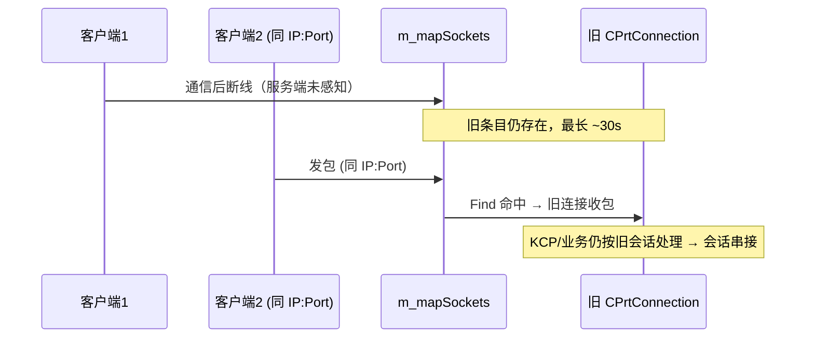

# UDP 连接风险分析

本文档分析 GammaNetwork / GammaConnects 中 **UDP 服务端按 `(src IP, Port)` 识别逻辑连接** 带来的风险，重点回答：

> 客户端 1 发送消息后关闭，一段时间后客户端 2 以相同 `src IP:Port` 发送消息，是否可能串包？

> 相关文档：[Socket全流程分析.md](./Socket全流程分析.md) · [网络架构分析.md](./网络架构分析.md)

---

## 1. 服务端路由机制

UDP listen socket 收到包后，以 `recvfrom` 返回的 **完整 `sockaddr`（IP + Port）** 为 key 查找或创建逻辑连接：

```289:304:source/gamma/GammaNetwork/CGSocket.cpp
				gammacstring strKey( szAddress, (uint32_t)nLen );
				auto pSocket = m_mapSockets.Find( strKey );
				if( pSocket == NULL )
				{
					pSocket = new CGSocketUDP( m_pNetwork );
					m_mapSockets.Insert( *pSocket );
					pSocket->m_strRemoteSockAddr.assign( szAddress, nLen, false );
					pSocket->m_strLocalSockAddr.assign(
						m_strLocalSockAddr.c_str(), m_strLocalSockAddr.size(), false );
					pSocket->m_hSocket = m_hSocket;
					pSocket->m_pWorkThread = m_pWorkThread;
					m_pWorkThread->NT_OnAccept( pSocket, m_pContext );
				}
				m_pWorkThread->NT_RecieveData( pSocket, szRecvBuf, nResult );
```

连接断开时，从 map 中移除：

```466:470:source/gamma/GammaNetwork/CGSocket.cpp
	void CGSocketUDP::NT_Close()
	{
		CGSocket::NT_Close();
		CGSocketUDPMap::CGammaRBTreeNode::Remove();
	}
```

**设计含义：** 框架把 `(remote IP, Port)` 当作 UDP「会话 ID」，不区分其背后是同一进程重连还是另一客户端。

---

## 2. 问题场景

```
时间线 ──────────────────────────────────────────────────────────►

客户端1  (192.168.1.5:50000)  发消息 → 关闭/断线
                                    │
                                    │  一段时间 Δt
                                    ▼
客户端2  (192.168.1.5:50000)  发消息 → 服务端如何路由？
```

**核心问题：** 服务端能否区分「客户端 1 重连」与「另一个实体占用了相同 `(IP, Port)`」？

**答案：** 当前实现 **不能**，且存在多种风险窗口。

---

## 3. 三种情况分析

### 3.1 情况 A：客户端 1 已完全清理，客户端 2 复用相同 IP:Port

```
客户端1 ShutDown
  → m_mapSockets 条目删除
  → CPrtConnection / ikcpcb 销毁
        │
        │  Δt 后
        ▼
客户端2 首包到达
  → Find(sockaddr) 失败
  → 新建 CGSocketUDP + CPrtConnection + 新 ikcpcb
```

| 风险类型 | 是否存在 |
|---------|---------|
| KCP 状态残留（客户端 2 继承客户端 1 的 ikcpcb） | **否** — 新建独立 `ikcpcb` |
| 业务层误认身份（新客户端被当作旧会话续接） | **是** — 无 session 标识，语义上无法区分 |
| 客户端 1 **迟到 UDP 包** 进入客户端 2 新会话 | **是** — 仍按 IP:Port 路由 |

**结论：** 不会出现「KCP 把两路字节拼成一条合法消息」的典型粘包，但 **脏包注入** 和 **身份混淆** 仍可能发生。

### 3.2 情况 B：客户端 1 已关闭，服务端旧会话仍在（最常见、风险最高）

UDP **没有 TCP 的 FIN**，客户端本地 `close` 后，服务端 **不会立即感知**。

空闲断开依赖心跳计数（`CPrtConnection::OnCheckTimeOut`）：

```209:211:source/gamma/GammaConnects/CPrtConnection.cpp
		if( GetConnMgr()->GetAutoDisconnectTime() < m_nRecvCount )
			OnHeartBeatStop();
```

- `OnCheckTimeOut` 约 **每秒** 执行一次（`CONNECTING_CHECK_TIME = 1000`）。
- 有收包时分派路径会重置 `m_nRecvCount`。
- 默认 `CreateConnMgr(30)` 时，约 **30 秒无收包** 才触发 `OnHeartBeatStop` → `ShutDown`。

**在这 ~30 秒内：**

- `m_mapSockets` 中 **仍是客户端 1 的条目**；
- 客户端 2 若以 **相同 IP:Port** 发包 → **全部进入客户端 1 的旧 `CPrtConnection`**；
- 旧 KCP（全局相同 `conv`）可能继续处理客户端 2 的数据 → **会话被劫持到旧连接**；
- 业务层若未做 session 校验，可能仍认为是原客户端。

**断开过程中的收包未屏蔽：**

```184:190:source/gamma/GammaNetwork/CGConnecter.cpp
		if( nSize == 0 )
			Close( eCE_NormalClose );
		else
			RecvData( pData, nSize );  // 未检查 Disconnecting 状态
```

`ShutDown` 到下一帧 `Check()` 执行 `ShutdownOnCheck` 之间，仍有 **约 1 帧** 窗口继续收包。



### 3.3 情况 C：客户端 1 主动 ShutDown，清理较快，客户端 2 几乎立即连上

- map 条目通常在 **1～2 个 `Check()` 周期** 内删除（两阶段 Close：`Disconnecting` → 下帧 `ShutdownOnCheck`）。
- 客户端 2 会 **新建** `CPrtConnection` 与 `ikcpcb`。
- 主要风险变为 **客户端 1 的迟到包** 误入客户端 2 新会话（同情况 A）。

---

## 4. 会不会「字节级串包」？

| 层级 | 是否会混 |
|------|---------|
| **KCP 重组** | 同一会话内按序号重组；序号/窗口异常的包会被丢弃，一般不会把两客户端字节拼成一条 **合法** KCP 消息 |
| **Shell / TDispatch** | 解析失败可能触发 `ShutDown`，不会无声合并 |
| **会话归属** | **会错** — 相同 IP:Port 在旧会话未清理时，客户端 2 流量进入客户端 1 连接 |
| **迟到包** | 旧会话销毁后，客户端 1 滞留 UDP 包可能进入客户端 2 **新会话** |

**准确表述：** 风险主要是 **会话识别错误** 与 **脏包注入**，而非 KCP 层经典意义上的「两路流合成一个包」。

---

## 5. 相同 IP:Port 何时 realistic？

| 场景 | 可能性 | 说明 |
|------|--------|------|
| 同机重启 App，OS 分配 **新** ephemeral 端口 | 高 | 端口通常 **不同**，不冲突 |
| NAT 超时后重连，映射复用公网 `(IP, Port)` | 中 | 运营商/NAT 设备行为 |
| 客户端快速 close 再 open，OS 复用本地端口 | 中 | 取决于 OS 端口分配策略 |
| 客户端 1 未断干净（心跳 ~30s），客户端 2 已上线 | 高 | **重叠窗口风险最大** |
| 同一 NAT 后多客户端 | 低（同端口） | 通常不同公网端口；同端口则必冲突 |

---

## 6. 与 KCP 全局相同 `conv` 的关系

当前所有 UDP 连接共用 `KCPCONFIG_CONV`（默认 `0xd14d4926`）。

- **不能** 靠 `conv` 区分「客户端 1 vs 客户端 2」— 分流仍依赖 IP:Port。
- 相同 `conv` 在「一地址一会话、独立 `ikcpcb`」模型下 **不会** 导致多连接共享同一 KCP 实例。
- 但在 **情况 B** 中，客户端 2 的包进入客户端 1 的 `ikcpcb`，`conv` 相同反而 **更容易被接受**（仅受 KCP 序号等约束）。

详见 [网络架构分析.md §9](./网络架构分析.md)。

---

## 7. 其他 UDP 相关风险（补充）

### 7.1 首包即建连

任意 `(IP, Port)` 的首个 UDP 包即可触发 `OnAccept` 并分配 `CPrtConnection`，无鉴权则存在 **连接表耗尽** 风险。

### 7.2 无应用层会话标识

框架不提供 session token / 连接代数（generation），**无法** 在协议层声明「我是新客户端」。

### 7.3 NAT 重绑定

公网 `(IP, Port)` 变化时，服务端视为 **新连接**；旧连接需等心跳超时才能清理，期间占用 map 条目。

### 7.4 服务端 UDP socket 共用

所有客户端共用 listen socket fd，per-client `CGSocketUDP` 仅作逻辑分流；关闭单客户端时 `NT_Close` 会从 `m_mapSockets` 移除，但需注意与 listener 共用 fd 的生命周期管理。

---

## 8. 风险汇总

| 编号 | 风险 | 严重程度 | 触发条件 |
|------|------|---------|---------|
| R1 | 旧会话未过期，同 IP:Port 流量进入旧连接 | **高** | 客户端静默断线 + 30s 内心跳未触发清理 |
| R2 | 新客户端被服务端语义上当作旧客户端 | **高** | 同 R1，且业务无 session 校验 |
| R3 | 迟到 UDP 包进入错误（新）会话 | **中** | 旧会话已销毁，网络滞留包到达 |
| R4 | 首包伪造源地址刷连接 | **中** | 无速率限制 / 无首包 token |
| R5 | KCP 字节流合并 | **低** | 序号保护；主要问题在会话层而非 KCP 重组 |

---

## 9. 缓解建议

### 9.1 应用层 Session Token（推荐）

- 首包或专用握手消息携带 `sessionId`（建议随机 64bit+）。
- 重连必须携带 **新 sessionId** 或服务端签发的 token。
- 服务端收到同 IP:Port 的新 sessionId 时：**ShutDown 旧连接** 再接受新会话。

### 9.2 缩短空闲超时

按业务调小 `CreateConnMgr(nAutoDisconnectTime)`，加快 `m_mapSockets` 条目回收。例如实时对战可设为 5～10 秒，需权衡误杀弱网客户端。

### 9.3 显式重连协议

```
Client → Server: CGC_Hello { sessionId, version, token }
Server: 校验 token，冲突则踢旧连接，回复 CGC_HelloAck
```

未通过握手前的 Shell 业务消息一律丢弃。

### 9.4 每连接唯一 KCP conv（可选增强）

如 `conv = hash(local_ip, local_port, remote_ip, remote_port, sessionId)`，两端握手同步。  
**仅能** 降低 KCP 误接受概率，**不能替代** sessionId。

### 9.5 连接代数（Generation）

服务端维护 `(IP, Port) → generation`，每次合法新连接 `generation++`；包内携带 generation，不匹配则丢弃。

### 9.6 运维层防护

- 连接数 / IP 速率限制；
- 首包大小与格式校验；
- 监控 `m_mapSockets` 规模异常增长。

---

## 10. 结论

**有可能出问题。** 在当前「按 `(src IP, Port)` 建连、无应用层 session 标识」的实现下：

1. **旧会话未过期**（默认约 30 秒无收包）时，相同 IP:Port 的流量会进入 **旧连接** → **会话串接**（情况 B，风险最高）；
2. **旧会话已清理** 后，相同 IP:Port 会 **新建连接**，但服务端 **无法区分** 新客户端与原客户端重连；
3. **迟到 UDP 包** 可能进入 **错误会话**（情况 A/C）；
4. KCP 层通常不会无声合并两路字节，但 **会话归属错误** 后果与「串包」对业务等价。

**不能单靠 `(IP, Port)` 保证会话唯一性与身份正确性。** 生产环境使用 `eConnType_UDP_Prt` 时，应在 Shell 层之上增加 **握手 + sessionId + 重连鉴权**。

---

## 11. 关键源码索引

| 主题 | 路径 |
|------|------|
| UDP 连接 map | `source/gamma/GammaNetwork/CGSocket.cpp` — `CGSocketUDP::NT_ProcessListener` |
| map 条目移除 | `source/gamma/GammaNetwork/CGSocket.cpp` — `CGSocketUDP::NT_Close` |
| 心跳 / 空闲断开 | `source/gamma/GammaConnects/CPrtConnection.cpp` — `OnCheckTimeOut` |
| 断开超时配置 | `source/gamma/GammaConnects/CConnectionMgr.cpp` — `CreateConnMgr` |
| 断开中仍收包 | `source/gamma/GammaNetwork/CGConnecter.cpp` — `OnEvent` |
| KCP 集成 | `source/gamma/GammaConnects/CPrtConnection.cpp` |
