# nany-cpp 网络框架架构分析

本文档整合 **GammaNetwork**（套接字 I/O 层）与 **GammaConnects**（连接与会话层）的整体架构，并包含 KCP 使用、UDP 连接识别、`conv` 配置等专题分析。

> 相关模块文档：[GammaNetwork.md](./GammaNetwork.md) · [GammaConnects.md](./GammaConnects.md)

---

## 1. 总体定位

nany-cpp 网络栈分为两层：

| 层级 | 模块 | 职责 |
|------|------|------|
| **I/O 层** | GammaNetwork | TCP/UDP/TLS 套接字、Reactor 事件循环、多网络线程、异步 DNS、对象池 |
| **会话层** | GammaConnects | 连接管理、Shell 协议分包、心跳、KCP/WebSocket、业务 `CBaseConn` 绑定 |

上层应用（游戏逻辑、示例程序）只需：

1. 派生 `CBaseConn`，实现 `OnShellMsg` / `OnConnected` / `OnDisConnect`
2. 通过 `CreateConnMgr()` 创建 `IConnectionMgr`
3. 主循环周期性调用 `IConnectionMgr::Check(nWaitTimes)`

---

## 2. 分层架构图

```
┌─────────────────────────────────────────────────────────────────┐
│  应用层：CBaseConn 子类（业务协议、OnShellMsg）                    │
└────────────────────────────┬────────────────────────────────────┘
                             │ SendShellMsg / OnShellMsg
┌────────────────────────────▼────────────────────────────────────┐
│  GammaConnects 会话层                                              │
│  IConnectionMgr (CConnectionMgr)                                 │
│    ├── CConnection      (Raw：无 Shell 封装)                       │
│    ├── CPrtConnection   (Prt：Shell + 可选 KCP)                    │
│    └── CWebConnection   (WebSocket + Shell)                        │
└────────────────────────────┬────────────────────────────────────┘
                             │ IConnectHandler::OnRecv / IConnecter::Send
┌────────────────────────────▼────────────────────────────────────┐
│  GammaNetwork I/O 层                                               │
│  INetwork (CGNetwork)                                              │
│    ├── CGNetThread × N  (Reactor：epoll / select)                  │
│    ├── CGSocketTCP / CGSocketUDP / CGSocketTCPS                    │
│    ├── CGConnecterTCP / CGConnecterUDP                             │
│    ├── CGListener                                                  │
│    └── CAddrResolution（异步 DNS）                                  │
└────────────────────────────┬────────────────────────────────────┘
                             │ BSD Socket / Winsock / OpenSSL
┌────────────────────────────▼────────────────────────────────────┐
│  操作系统内核                                                       │
└─────────────────────────────────────────────────────────────────┘
```

---

## 3. 类图（UML）

### 3.1 GammaNetwork 核心接口与实现

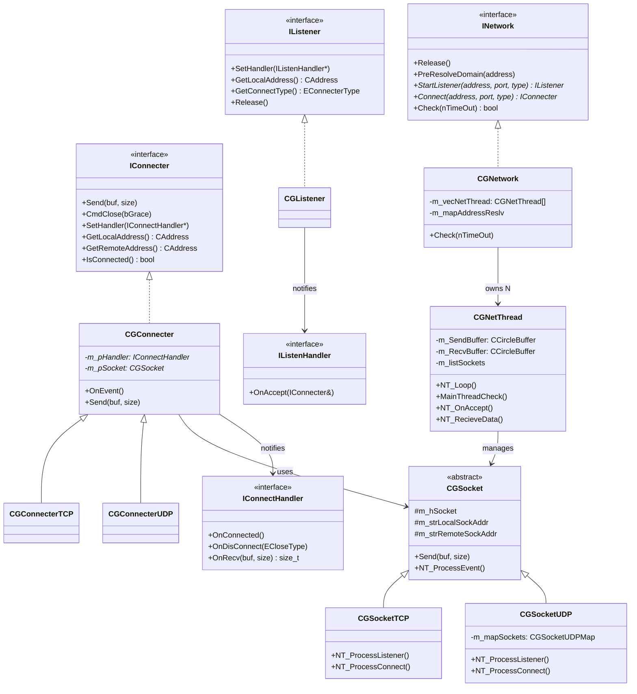

### 3.2 GammaConnects 核心类关系

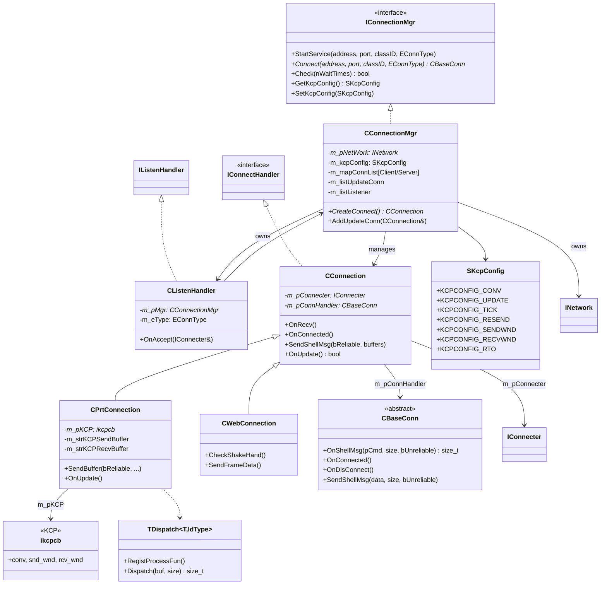

### 3.3 连接类型与实现映射

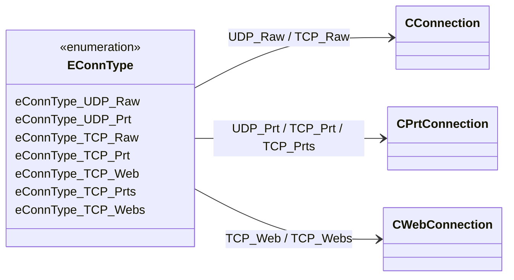

| EConnType | 实现类 | 传输 | KCP | Shell 协议 |
|-----------|--------|------|-----|-----------|
| `eConnType_UDP_Raw` | `CConnection` | UDP | 否 | 否 |
| `eConnType_UDP_Prt` | `CPrtConnection` | UDP | **是** | 是 |
| `eConnType_TCP_Raw` | `CConnection` | TCP | 否 | 否 |
| `eConnType_TCP_Prt` | `CPrtConnection` | TCP | 否 | 是 |
| `eConnType_TCP_Prts` | `CPrtConnection` | TCP+TLS | 否 | 是 |
| `eConnType_TCP_Web` | `CWebConnection` | WebSocket | 否 | 是（二进制帧） |
| `eConnType_TCP_Webs` | `CWebConnection` | WSS | 否 | 是 |

---

## 4. 线程模型与事件流

### 4.1 双线程域协作

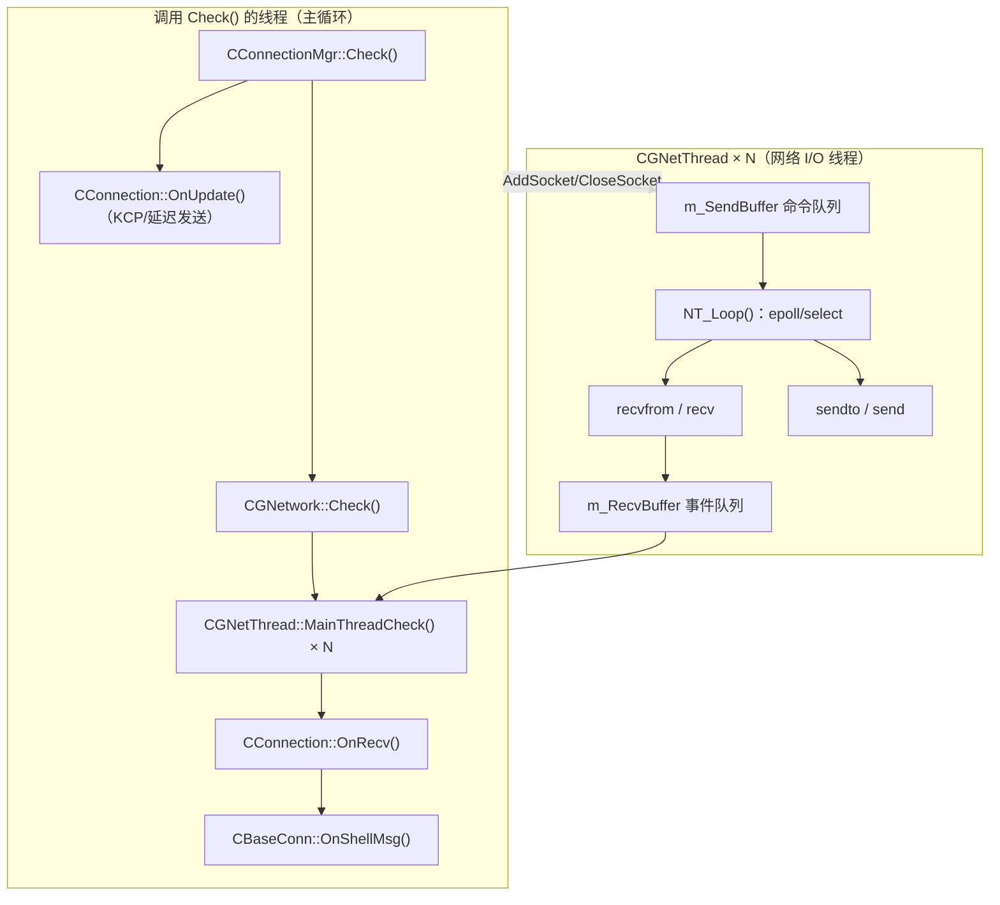

**关键结论：**

- `OnRecv`、`OnConnected`、`OnDisConnect`、`OnShellMsg` 均在**调用 `Check()` 的线程**上执行。
- 网络线程只负责 I/O 与事件入队，不直接回调业务逻辑。
- **必须周期性调用 `Check()`**，否则 DNS 收尾、KCP update、心跳、断线清理均会停滞。

### 4.2 TCP 与 UDP 的线程差异

| 协议 | Accept/首包 | Socket 归属 | 线程分配 |
|------|------------|-------------|---------|
| **TCP** | `accept` 得到独立 fd | 每连接独立 socket | 可负载均衡到不同 `CGNetThread` |
| **UDP 服务端** | 首包 `recvfrom` 触发建连 | **所有客户端共用 listen socket** | 固定留在 listener 所在网络线程 |
| **UDP 客户端** | `Connect` 后 bind 本地端口 | 独立 socket（绑定远端） | 分配到选定网络线程 |

---

## 5. 连接建立时序

### 5.1 TCP 服务端 Accept

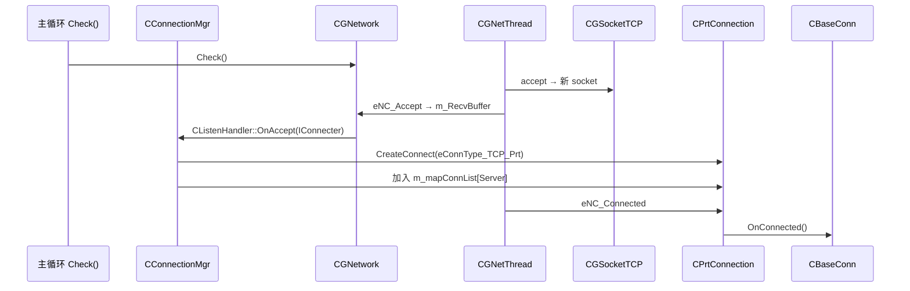

### 5.2 UDP 服务端首包建连

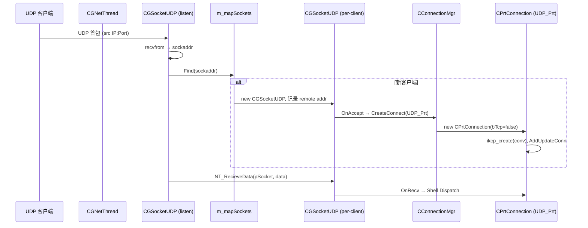

### 5.3 客户端主动连接

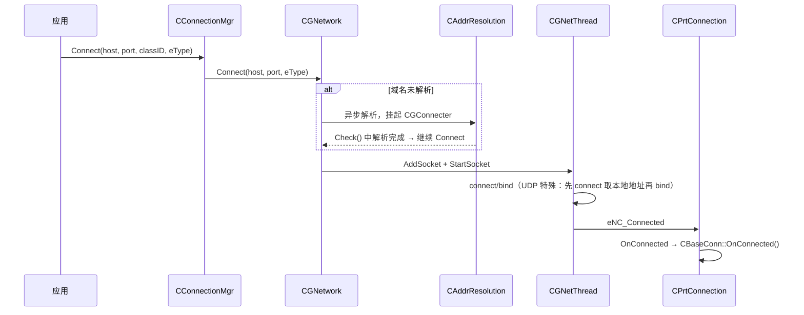

---

## 6. 数据收发路径

### 6.1 收包路径（TCP_Prt 为例）

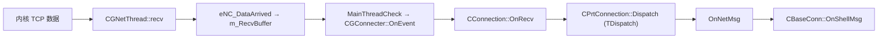

### 6.2 发包路径（TCP_Prt）

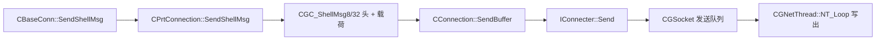

---

## 7. Shell 协议层（GammaPrt）

`CPrtConnection` / `CWebConnection` 在传输层之上封装 **Shell 分包**：

| 消息 ID | 类 | 用途 |
|---------|-----|------|
| 0–252 | `CGC_ShellMsg8` | 变长 Shell 消息，长度 = `GetId()*256 + nMsgLen` |
| 253 | `CGC_ShellMsg32` | 大消息（> 65535 字节） |
| 254 | `CGC_HeartbeatMsg` | 心跳请求 |
| 255 | `CGC_HeartbeatReply` | 心跳回复（用于 RTT 统计） |

业务协议在 Shell 载荷内再定义自己的消息头（如 `SMsgHeader`）。

`TDispatch` 负责按消息 ID 注册校验函数与处理函数，支持变长包解析（`GetExtraSize`）。

---

## 8. KCP 专题分析

### 8.1 启用条件

KCP **仅在** `eConnType_UDP_Prt` 且 `CPrtConnection(bTcp=false)` 时创建：

- `eConnType_TCP_Prt` 不使用 KCP（TCP 已提供可靠传输）
- 每个 UDP 连接持有独立的 `ikcpcb*`（`m_pKCP`）

### 8.2 KCP 在协议栈中的位置

```
CBaseConn::SendShellMsg
        ↓
CPrtConnection::SendShellMsg (bReliable / bUnreliable)
        ↓
┌───────────────────┬──────────────────────┐
│ bReliable=true    │ bUnreliable=true      │
│ → m_strKCPSendBuffer│ → 直接 Shell+UDP    │
│ → ikcp_send       │   (绕过 KCP)          │
│ → KcpCallback     │                       │
│ → Shell(id≥4)+UDP │                       │
└───────────────────┴──────────────────────┘
        ↓
GammaNetwork UDP sendto
```

### 8.3 KCP 初始化参数

默认配置（`CConnectionMgr` 构造函数）：

| 字段 | 默认值 | 映射到 ikcp |
|------|--------|------------|
| `KCPCONFIG_CONV` | `0xd14d4926` | `ikcp_create(conv)` |
| `KCPCONFIG_UPDATE` | 33 ms | 发送缓冲 flush 间隔 |
| `KCPCONFIG_TICK` | 10 ms | `ikcp_nodelay` interval |
| `KCPCONFIG_RESEND` | 2 | `ikcp_nodelay` resend |
| `KCPCONFIG_SENDWND/RECVWND` | 128 | `ikcp_wndsize` |
| `KCPCONFIG_RTO` | 10 ms | `rx_minrto` |

额外调用：

- `ikcp_nodelay(kcp, 1, tick, resend, 1)` — 开启 nodelay，关闭常规拥塞控制
- `ikcp_setmtu(kcp, MAX_RAW_UPD_SIZE - 1)` — MTU = 1023

### 8.4 KCP 与 Shell 的消息 ID 复用

`MAX_RAW_UPD_SIZE = 1024`，`MAX_RAW_UPD_SIZE/256 = 4`。

| GetId() 范围 | 含义 |
|-------------|------|
| 0–3 | 普通 Shell 消息，长度 = `GetId()*256 + nMsgLen` |
| ≥ 4 | KCP 控制/数据包，长度 = `(GetId()-4)*256 + nMsgLen` |

**KcpCallback（KCP 输出）** 封装规则：

```cpp
uint8_t nId = (uint8_t)(len >> 8) + MAX_RAW_UPD_SIZE/256;  // len/256 + 4
NetData.nMsgLen = (uint8_t)(len);
SendBuffer(false, ...);  // 不可靠直发 UDP
```

**接收侧**：`GetId() >= 4` 的包喂给 `ikcp_input`，重组后由 `ikcp_recv` 写入 `m_strKCPRecvBuffer`，再 `Dispatch` 到业务。

### 8.5 KCP 驱动循环（OnUpdate）

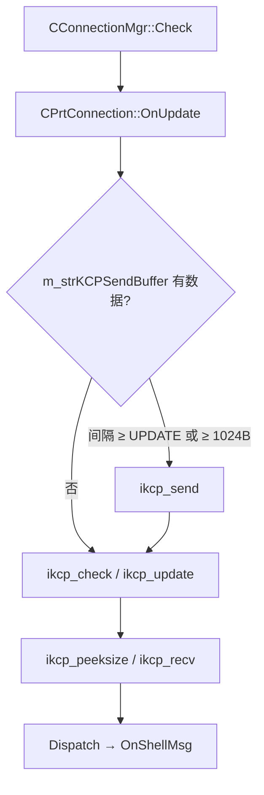

### 8.6 可靠 vs 不可靠语义

| API | 参数 | UDP+KCP 行为 |
|-----|------|-------------|
| `SendShellMsg(data)` | `bUnreliable=false` | 走 KCP 可靠通道 |
| `SendShellMsg(data, true)` | `bUnreliable=true` | 绕过 KCP，直接 UDP |
| 心跳 | 内部 `SendBuffer(true)` | 始终可靠 |

---

## 9. KCPCONFIG_CONV 全局相同是否合理

### 9.1 结论

| 维度 | 评价 |
|------|------|
| **功能正确性** | **合理** — 不会因 conv 相同导致多连接串包 |
| **协议设计语义** | **可用但不理想** — conv 未承担会话区分职责 |
| **安全性** | **一般** — 固定值无额外防护，对内网游戏通常可接受 |

### 9.2 原因分析

KCP 规范要求：**同一会话两端 conv 相同**，并不要求不同会话 conv 互异。

本项目分流顺序：

```
UDP 包 → 按 (remote IP, Port) 分到 CPrtConnection → Shell 层 → ikcp_input（校验 conv）
```

每个 `CPrtConnection` 有独立 `ikcpcb`，包在进入 KCP 前已被 UDP 地址隔离，因此全局同一 conv **不会混包**。

### 9.3 何时会有问题

仅当**多个 ikcpcb 共享同一条 UDP 通道且仅靠 conv 区分**时，全局相同 conv 才会出错。当前架构是一地址一会话，不存在此场景。

### 9.4 改进建议（可选）

1. **保持现状**：将 conv 视为协议 magic number，文档化即可。
2. **每连接独立 conv**：如 `hash(local_ip, local_port, remote_ip, remote_port)`，两端用相同算法，无需额外握手。
3. **公网高对抗场景**：结合应用层 session token，不依赖 conv 做安全边界。

---

## 10. UDP 按 remote IP:Port 区分连接是否合理

### 10.1 结论

**合理，且是 UDP 游戏服务器的标准实践。**

### 10.2 实现机制

服务端 listen socket 收到包后，以 `recvfrom` 返回的**完整 sockaddr（IP + Port）** 为 key：

```cpp
gammacstring strKey(szAddress, nLen);
auto pSocket = m_mapSockets.Find(strKey);
if (pSocket == NULL) {
    pSocket = new CGSocketUDP(...);
    pSocket->m_strRemoteSockAddr.assign(szAddress, nLen);
    OnAccept(pSocket);  // → CPrtConnection
}
NT_RecieveData(pSocket, data);
```

回包时对应该客户端的 `m_strRemoteSockAddr` 执行 `sendto`。

这是 **有状态 UDP（connected UDP session）** 模型：底层无连接，逻辑层把 `(IP, Port)` 当作会话标识。

### 10.3 适用场景

| 场景 | 是否有问题 |
|------|-----------|
| 服务端多客户端（不同 IP/Port） | 无 |
| 同 NAT 后多客户端（不同公网端口） | 无 |
| 同机多开（不同本地端口） | 无 |
| 客户端连多个服务端 | 无（各自独立 socket） |

### 10.4 已知局限

| 问题 | 说明 | 常见应对 |
|------|------|---------|
| **NAT 重绑定** | 公网 IP:Port 变化 → 服务端视为新连接，旧 KCP/业务状态不迁移 | 应用层 session id + 重连鉴权 |
| **首包即建连** | 任意源地址首包可触发资源分配 | 限流、首包 token 校验 |
| **同端口多逻辑会话** | 无法在同一 `(IP,Port)` 上区分多条 KCP 会话 | 需应用层 session id 或 per-connection conv |

### 10.5 与 KCP conv 的分工

```
UDP 层：(IP, Port) 区分连接     ← 主要分流手段
KCP 层：conv 校验同会话         ← 当前为固定魔数
Shell 层：消息 ID 区分 KCP 包 vs 普通包
```

---

## 11. 连接生命周期

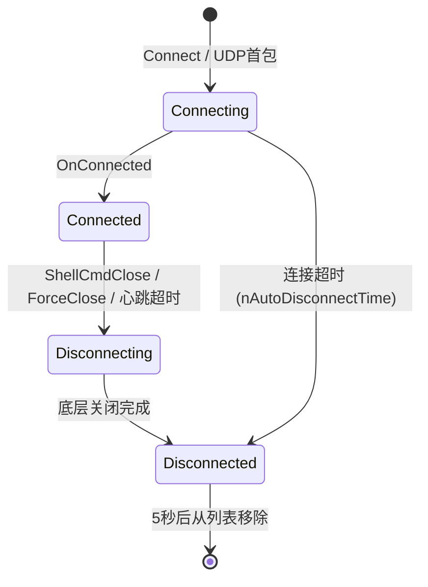

**关闭类型（ECloseType）：**

- `eCE_GraceClose` — 应用层优雅关闭（`ShellCmdClose`）
- `eCE_ForceClose` — 应用层强制关闭（`ForceClose`）
- 其余 — 底层/network 异常关闭

**CConnectionMgr 维护：**

- 每秒 `OnCheckConnecting()`：心跳检测、超时断开
- 已断开连接 5 秒后清理（`DISCONNECT_TIME`）

---

## 12. 关键源码索引

| 主题 | 路径 |
|------|------|
| 网络接口 | `include/gamma/GammaNetwork/INetworkInterface.h` |
| 网络实现 | `source/gamma/GammaNetwork/CGNetwork.cpp` |
| 网络线程 | `source/gamma/GammaNetwork/CGNetThread.cpp` |
| UDP 连接映射 | `source/gamma/GammaNetwork/CGSocket.cpp`（`CGSocketUDP`） |
| 连接管理器 | `source/gamma/GammaConnects/CConnectionMgr.cpp` |
| 基础连接 | `source/gamma/GammaConnects/CConnection.cpp` |
| Prt + KCP | `source/gamma/GammaConnects/CPrtConnection.cpp` |
| WebSocket | `source/gamma/GammaConnects/CWebConnection.cpp` |
| Shell 协议 | `source/gamma/GammaConnects/GammaPrt.h` |
| KCP 库 | `source/gamma/GammaConnects/ikcp.h`, `ikcp.cpp` |
| 连接类型/KCP 配置 | `include/gamma/GammaConnects/ConnectDef.h` |
| 业务基类 | `include/gamma/GammaConnects/CBaseConn.h` |
| 示例 | `sample/GammaConnects/client.cpp`, `server.cpp` |

---

## 13. 使用要点 checklist

- [ ] 主循环必须周期性调用 `IConnectionMgr::Check(nWaitTimes)`
- [ ] 监听与连接使用一致的 `EConnType`
- [ ] UDP+KCP 使用 `eConnType_UDP_Prt`（sample 默认 TCP_Prt 不走 KCP）
- [ ] 可靠消息：`SendShellMsg(data)`；高频状态同步：`SendShellMsg(data, true)` 走不可靠 UDP
- [ ] 移动网络/频繁重连场景：在 Shell 之上增加 session token，不能仅依赖 IP:Port
- [ ] 可选：通过 `SetKcpConfig()` 调整延迟/窗口；`SetHeartBeatInterval()` 调整心跳

---

## 14. 总结

nany-cpp 网络框架采用 **GammaNetwork（Reactor I/O）+ GammaConnects（会话/协议）** 两层架构，通过 `Check()` 驱动的事件模型将网络 I/O 与业务回调解耦。UDP 服务端以 **(remote IP, Port)** 识别逻辑连接，KCP 在 `UDP_Prt` 模式下提供可靠传输并与不可靠 UDP 共存。全局固定 `KCPCONFIG_CONV` 在当前「一地址一会话、每连接独立 ikcpcb」模型下功能正确，conv 主要起协议校验而非会话分流作用。整体设计符合游戏服务器常见实践，扩展时需关注 NAT 重绑定与应用层会话恢复。
